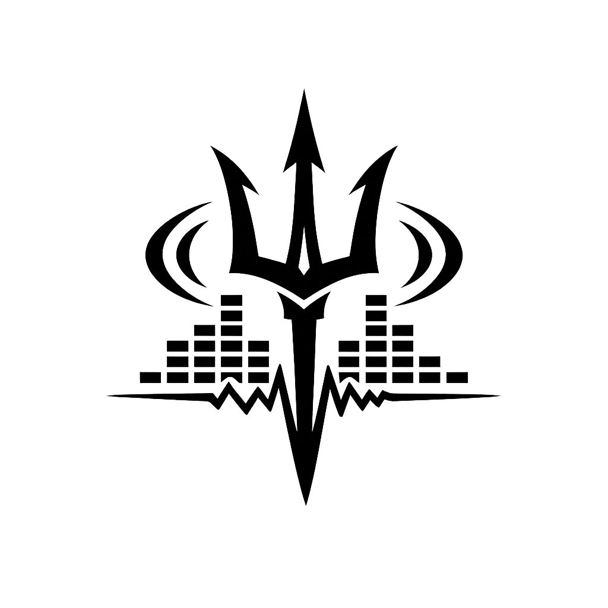

# Auralis DAW

A desktop Digital Audio Workstation built with Tauri 2 + Rust + React/TypeScript, targeting Windows.

## Tech Stack

| Layer | Technology |
|-------|-----------|
| Framework | Tauri 2.x |
| Frontend | React 18 + TypeScript + Vite |
| Styling | Tailwind CSS + Radix UI |
| State | Zustand + Immer |
| Backend | Rust (src-tauri/) |
| Audio I/O | cpal with ASIO feature |
| MIDI | midir |
| Audio Decode | symphonia |
| Sample Rate | rubato |
| Database | SQLite (rusqlite bundled) |
| Auth | argon2 |

## Prerequisites

- [Rust toolchain](https://rustup.rs/) (stable, 1.77+)
- [Node.js](https://nodejs.org/) 22+
- [Tauri v2 system dependencies](https://v2.tauri.app/start/prerequisites/) — WebView2 runtime, Visual Studio Build Tools
- [LLVM](https://llvm.org/builds/) 21+ — required for cpal ASIO bindings
  - Set `LIBCLANG_PATH` to your LLVM `bin/` directory (e.g. `C:\Program Files\LLVM\bin`)
- [Steinberg ASIO SDK 2.3.3](https://www.steinberg.net/asiosdk)
  - Set `CPAL_ASIO_DIR` to the SDK root (e.g. `C:\Users\<you>\ASIO_SDK`)
- [ASIO4ALL](http://www.asio4all.org/) — optional, for low-latency audio on consumer hardware

## Setup

```bash
# Install npm dependencies
npm install

# Verify Rust compilation
cd src-tauri && cargo check && cd ..

# Run in development mode
npm run tauri dev

# Run tests
npm test                     # TypeScript/React tests (vitest)
cd src-tauri && cargo test   # Rust unit tests
```

## Build

```bash
npm run tauri build
```

Produces a Windows NSIS installer at `src-tauri/target/release/bundle/nsis/`.

## Project Structure

```
src/                          # React/TypeScript frontend
  components/
    auth/                     # Login, register UI
    daw/                      # Main DAW shell, track management, menus
    instruments/              # Synth, sampler, drum machine UI
    effects/                  # EQ, reverb, compressor, delay UI
    mixer/                    # Mixer channel strips and master
    timeline/                 # Song timeline, piano roll, step sequencer
    ErrorBoundary.tsx         # Root error boundary (last-resort crash display)
  stores/                     # Zustand + Immer state stores
  hooks/                      # Shared React hooks (MIDI learn, undo/redo, etc.)
  lib/
    ipc.ts                    # All Tauri IPC calls (typed wrappers)
  styles/                     # Global CSS + Tailwind config

src-tauri/src/                # Rust backend
  audio/                      # Audio engine, device management, transport clock
  midi/                       # MIDI I/O, event bus, CC mapping, MIDI import/export
  instruments/                # DSP: synth, sampler, drum machine, LFO modulation
  effects/                    # DSP: EQ, reverb, compressor, delay
  project/                    # Project file save/load (.mapp format)
  auth/                       # SQLite authentication (argon2)
  config/                     # App preferences persistence (TOML)
  browser/                    # File system browser + audio preview
  presets/                    # Instrument & effect preset management
  vst3/                       # VST3 plugin host

docs/sprints/                 # Maestro sprint workflow docs
```

## Features

### Implemented (46 sprints across 11 epics)

| Area | Features |
|------|---------|
| **Foundation** | Tauri 2 scaffold, ASIO/WASAPI audio engine, MIDI I/O, project file system (.mapp), transport & tempo engine, global undo/redo, main DAW shell |
| **Auth** | Local user accounts with argon2 password hashing, SQLite storage |
| **Instruments** | Subtractive synthesizer, sample player/sampler, drum machine, audio recording (live input), LFO modulation routing |
| **Composition** | Step sequencer, piano roll editor, pattern system, song timeline/playlist, automation editor, arrangement playback engine, MIDI file import/export, MIDI recording, punch in/out, loop recording & take lanes, tempo automation |
| **Audio Editing** | Waveform editor (cut, trim, reverse, splice), time stretch & pitch shift |
| **Mixer & Effects** | Full mixer (tracks, routing, sends, buses), EQ & filter, reverb & delay, compression & dynamics, effect chain & modular routing, audio clip playback, sidechain compression, sub-group bus routing, audio clip fades |
| **Export** | Audio export (stereo mix & stems) |
| **VST3** | VST3 plugin host (Rust), VST3 UI bridge & plugin management |
| **Settings** | Settings & preferences UI, keyboard shortcut remapping |
| **Workflow** | Sample & content browser, MIDI learn & hardware controller mapping, track freeze & bounce in place |
| **Presets** | Instrument & effect preset management, factory presets (synth, drum, EQ) |

### Known Limitations / Active Backlog (Sprints 47–61)

- EQ settings do not persist across project save/load (Sprint 47)
- Clip dragging feels unresponsive until first transport tick (Sprint 47)
- Track freeze does not apply the effect chain (Sprint 47)
- Sampler and drum machine parameters cannot be MIDI-mapped (Sprint 52)
- Rust tests do not run in CI — cargo not available in codespace (Sprint 60)
- No factory presets for Reverb, Delay, or Compressor (Sprint 57)

## Architecture Notes

### Async runtime in Tauri setup

All background tasks in `src-tauri/src/lib.rs` use `tauri::async_runtime::spawn` (not `tokio::spawn`). Tauri 2's `.setup()` callback runs before the Tokio reactor is active — `tokio::spawn` panics there. `tauri::async_runtime::spawn` uses Tauri's own managed runtime handle and is safe from the setup context.

### Zustand selector stability

Any selector that constructs a derived collection must use `useShallow` from `zustand/react/shallow`:

```ts
// WRONG — returns new array reference every render → infinite re-render loop
const ids = useStore((s) => Object.keys(s.items));

// CORRECT — shallow comparison stops the loop
const ids = useStore(useShallow((s) => Object.keys(s.items)));
```

This applies to `Object.keys`, `Object.values`, `Object.entries`, `.map()`, `.filter()`, and any spread that produces a new array/object.

### Audio thread rules

- The audio callback (`process()`) must **never** allocate memory, block, or acquire a `std::sync::Mutex`
- Continuous param changes use `Arc<AtomicF32>` (lock-free reads)
- Discrete commands use `crossbeam-channel` (non-blocking send from control thread)
- All background tasks in the control thread use `tauri::async_runtime::spawn`

## Repository

GitHub: https://github.com/JustinSRao/Auralis_DAW
