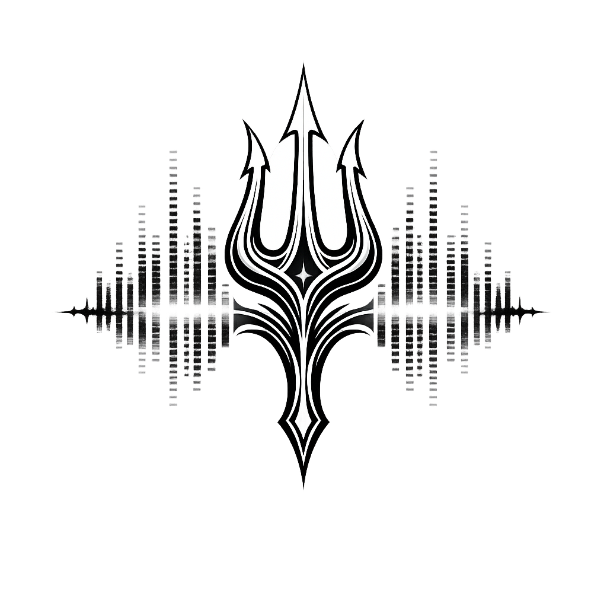

# Auralis DAW

A desktop Digital Audio Workstation built with Tauri 2 + Rust + React/TypeScript, targeting Windows.

## Tech Stack

| Layer | Technology |
|-------|-----------|
| Framework | Tauri 2.x |
| Frontend | React 18 + TypeScript + Vite |
| Styling | Tailwind CSS + Radix UI |
| State | Zustand + Immer |
| Backend | Rust (src-tauri/) |
| Audio I/O | cpal with ASIO feature |
| MIDI | midir |
| Audio Decode | symphonia |
| Sample Rate | rubato |
| Database | SQLite (rusqlite bundled) |
| Auth | argon2 |

## Prerequisites

- [Rust toolchain](https://rustup.rs/) (stable, 1.77+)
- [Node.js](https://nodejs.org/) 22+
- [Tauri v2 system dependencies](https://v2.tauri.app/start/prerequisites/) — WebView2 runtime, Visual Studio Build Tools
- [LLVM](https://llvm.org/builds/) 21+ — required for cpal ASIO bindings
  - Set `LIBCLANG_PATH` to your LLVM `bin/` directory (e.g. `C:\Program Files\LLVM\bin`)
- [Steinberg ASIO SDK 2.3.3](https://www.steinberg.net/asiosdk)
  - Set `CPAL_ASIO_DIR` to the SDK root (e.g. `C:\Users\<you>\ASIO_SDK`)
- [ASIO4ALL](http://www.asio4all.org/) — optional, for low-latency audio on consumer hardware

## Setup

```bash
# Install npm dependencies
npm install

# Verify Rust compilation
cd src-tauri && cargo check && cd ..

# Run in development mode
npm run tauri dev

# Run tests
npm test                     # TypeScript/React tests (vitest)
cd src-tauri && cargo test   # Rust unit tests
```

## Build

```bash
npm run tauri build
```

Produces a Windows NSIS installer at `src-tauri/target/release/bundle/nsis/`.

## Project Structure

```
src/                          # React/TypeScript frontend
  components/
    auth/                     # Login, register UI
    daw/                      # Main DAW shell and track management
    instruments/              # Synth, sampler, drum machine, LFO UI
    effects/                  # EQ, reverb, compressor UI
    mixer/                    # Mixer channel strips
    timeline/                 # Song timeline, piano roll, step sequencer
  stores/                     # Zustand state stores
  lib/
    ipc.ts                    # All Tauri IPC calls (typed wrappers)
  styles/                     # Global CSS + Tailwind config

src-tauri/src/                # Rust backend
  audio/                      # Audio engine, device management, graph, transport clock
  midi/                       # MIDI I/O, event bus, CC mapping, MIDI import
  instruments/                # DSP: synth, sampler, drum machine, LFO modulation
  effects/                    # DSP: EQ, reverb, compressor, delay
  project/                    # Project file save/load (.mapp format)
  auth/                       # SQLite authentication
  config/                     # App preferences persistence
  browser/                    # File system browser + audio preview
  presets/                    # Instrument & effect preset management
  vst3/                       # VST3 plugin host

docs/sprints/                 # Maestro sprint workflow
```

## Sprint Plan

46 sprints across 11 epics. See `docs/sprints/` for the full plan.

### Completed

| Epic | Title | Sprints | Status |
|------|-------|---------|--------|
| 1 | Foundation & Infrastructure | 1, 2, 3, 4, 25, 26, 30 | Done |
| 2 | Authentication & User Management | 5 | Done |
| 3 | Software Instruments | 6, 7, 8, 9, 33 | Done |

### Planned

| Epic | Title | Sprints |
|------|-------|---------|
| 4 | Composition Tools | 10, 11, 12, 13, 14, 36, 31, 32, 38, 44, 41, 43 |
| 5 | Audio Editing | 15, 16 |
| 6 | Mixer & Effects | 17, 18, 19, 20, 21, 37, 39, 42, 45 |
| 7 | Export & Finalization | 22 |
| 8 | VST3 Plugin Support | 23, 24 |
| 9 | Settings & Preferences | 27, 46 |
| 10 | Workflow & Productivity | 28, 29, 40 |
| 11 | Preset Management | 34 |

## Repository

GitHub: https://github.com/JustinSRao/Auralis_DAW
